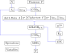
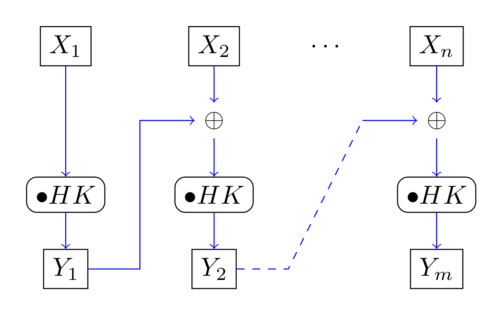

# 09. Hash Functions and MACs

## Hash Functions

A **public** function $H$ such that:

- $H$ is simple and fast to compute
- $H$ takes as input message $m$ of **abitrary length** andoutputs a *message digest* $H(m)$ of **fixed length**

### Security Properties

- Collision resistant: it should be infeasible to find any two values $x_1$ and $x_2$ such that $H(x_1) = H(X_2)$
- Second-preimage resistant: given a value $x_1$, it should be infeasible to find a different value $x_2$ such that $H(x_1) = H(x_2)$
- Preimage resistant (one-way): given a value $y$, it should be infeasible to find any input $x$ such that $H(x) = y$

If an attacker can break second-preimage resistance, they can also break collision resistance.

#### Birthday Paradox

If there is a group of 23 people, there is over a 50% chance that at least two people have the same birthday.

If choosing $\sqrt{|S|}$ values from a set $S$, the probability of getting two values the same is about half ($n \approx \sqrt{2|S| \cdot p_\text{collision}}$).

Hence, if $H$ is a hash function with an output size of $k$ bits, $2^{k/2}$ trials will be enough to find a collision half the time (assuming $H$ is a random function).

Today, $2^{128}$ trials is considered infeasible so hash functions should have an output of at least 256 bits for collision resistance.

### Iterated Hash Functions

Iterated hash functions splits the input into fixed-size blocks and operates on them sequentially.

#### Merkle-Damgård Construction

A *compression function* $h$ taking fixed-sized inputs and applies them to the blocks of the message.

The compression function takes two $n$-bit input strings $x_1$ and $x_2$ and produces an $n$-bit output string $y$:

```
m = m_1 || m_2 || m_3 || … || m_l

       m_1    m_2    m_3      m_l pad+len 
        |      |      |        |     |
        |      |      |        |     |
        v      v      v        v     v
IV ---> h ---> h ---> h --..-> h---> h ---> H(m)
```

Security: if compression function $h$ is collision-resistant, $H$ function is also collision resistant.

Weaknesses:

- Length extension attacks: an attacker may be able to reconstruct the internal state of the hash function from the hash, allowing them to add arbitrary data and construct a valid hash. In the Merkle-Damgård construction, the hash is the full internal state so it is vulnerable to this attack
- Second-preimage attacks: not as hard as they should be
- Collisions for multiple messages: not that too much more difficult than finding collisions for two messages

The Merkle-Damgård construction is used in MD5, SHA-1 and SHA-2.

### Standardized Hash Functions

#### MDx Family

Proposed by Ron Rivest, widely used in the 1990s.

128-bit output, all broken.

#### Secure Hash Algorithm (SHA)

Based on MDx family, more complex design with 160 bit output.

SHA-0 introduced 1993, SHA-1 in 1995 with minor changes. Both broken.

#### SHA-2 Family

Standardized 2015.

Minimum of SHA-256 (256 bit hash, 512 bit blocks) - same security as AES-128.

Most secure is SHA-512: 512 bit hash, 1024 bit blocks.

Padding:

- Message length field: 64 bits for 512 bit blocks, 128 bits for 1024 bit blocks.
- Always at least one bit of padding
- There is one `1` bit, some number of `0` bits (enough to make blocks full) and then the length field
- Padding and length fields may add an extra block

#### SHA-3

MDx, SHA families based on the same basic design which were vulnerable to a few unexpected attacks.

Keccak function picked by NIST in 2015 as as SHA-3: uses *sponge function* instead of compression.

### Using Hash Functions

Hash functions do not depend a key; anyone can calculate it so it is not encryption.

However, it does help to provide data authentication:

- Authenticating the hash of a message to authenticate the message
- Building blocks for MACs
- Building blocks for signatures

Password storage:

- Pick random salt: makes it resistant to rainbow table attacks as there needs to be a different dictionary for every salt
- Compute $h = H(\text{password}, \text{salt})$
- Store salt and hash value

## Message Authentication Code

Ensures message integrity. takes in a message $M$ of arbitrary length and secret key $K$ and outputs a fixed-sized tag $T = \mathrm{MAC}(M, K)$.

The tag $T$ is appended to the message and the recipient can compute $T'$ with the message they receieve and their shared secret, checking to ensure that $T' = T$.

**Unforgeability**: not feasible to produce a valid pair $(M, T)$ such that $T = \mathrm{MAC}(M, K)$ without knowledge of $K$.

**Unforgeability under chosen message attack**: even with access to an oracle that can calculate the MAC for an input message of the attacker's choosing, they cannot create a valid tag themselves (i.e. guess the private key from tags they ask the oracle to generate).

### MAC from Hash Function (HMAC)

Proposed by Bellare, Canetti and Krawczyk in 1996.

Can be built from any iterated hash function $H$.

With a key $K$ that has been padded with zeroes to be the required block size and two fixed strings:

- `opad = 0x5c5c...5c`
- `ipad = 0x3636...36`

$$
\mathrm{HMAC}(M, K) = H((K \oplus \mathrm{opad}) \| H((K \oplus \mathrm{ipad}) \| M))
$$

HMAC is secure if $H$ is collision resistant or $H$ is a pseudorandom function. It is designed to resist length-extension attacks, even if $H$ is a Merkle-Damgård construct.

HMAC is often used as a pseudorandom function to derive subkeys.

## Authenticated Encryption

A and B share a key $K$ and $A$ wishes to send a message $M$ with confidentiality and authenticity/integrity.

Two options:

- Split $K$ into $K_1$ and $K_2$, encrypting $M$ with $K_1$ and using $K_2$ with a MAC
- Use an *authenticated encryption algorithm* that provides both

### Combining Encryption and MAC

Three options:

- Encrypt-and-MAC: encrypt $M$, apply MAC to $M$ and send the ciphertext $C$ and tag $T$ 
- MAC-then-encrypt: calculate the MAC on $M$, encrypt $M \| T$ then send the ciphertext $C$
- Encrypt-then-MAC: encrypt $M$, calculate the MAC on the ciphertext $C$ and then send $C$ and tag $T$

Encrypt-then-MAC is the safest option: $C = E(M, K_1)$, $T = \mathrm{MAC}(C, K_2)$, send $C \| T$

MAC-then-encrypt was used in older versions of TLS while newer versions use authentication encryption modes.

### CTR Mode for Block Ciphers

Synchronous stream cipher. Counter initialized with random nonce $N$, keystream generated by encrypting successive values of the counter:

$$
O_t = E(N||t, K)
$$

where $t$ is the block number.

Encryption and decryption is simply XORing the plain/ciphertext with $O_t$.

### Galois Counter Mode (GCM)

CCM mode cannot be used for processing of streaming data: formatting function for $N$, $A$ and $P$ requires knowledge of the length of $A$ and $P$.

Combines CTR mode on the block cipher $E$ with a special keyed hash function GHASH (uses multiplication in finite field $\mathrm{GF}(2^{128})$.

- Input: plaintext $P$, authenticated data $A$, nonce $N$
- Outputs: ciphertext $C$, tag $T$
- Lengths $\mathrm{len}_A$ and $\mathrm{len}_C$ are 64 bit values
  - $u$ and $v$ are the minimum numbers of zeros required to expand $A$ and $C$ to complete blocks
- Length $t$ of $T$ is 128 bits, $N$ is 96 bits long
- Initial block input: $J_0 = N \| 0^{31} \| 1$
- Function $\mathrm{inc}_32$ increments 32 MSB of the input string by $1 \pmod{2^{32}}$



GHASH:



$HK = E(0^{128}, K)$ is the hash subkey. $\cdot$ is multiplication in the finite field.

Output is $Y_m = \mathrm{GHASH}_{HK}(X_1, \dots, X_m)$

Decryption:

- Receiver receives ciphertext $C$, nonce $N$, tag $A$, authenticated data $A$
- Receiver computes tag $T'$ using shared key $K$, compares with $T$
- If the same, $P$ can be computed by generated the same keystream from CTR mode

